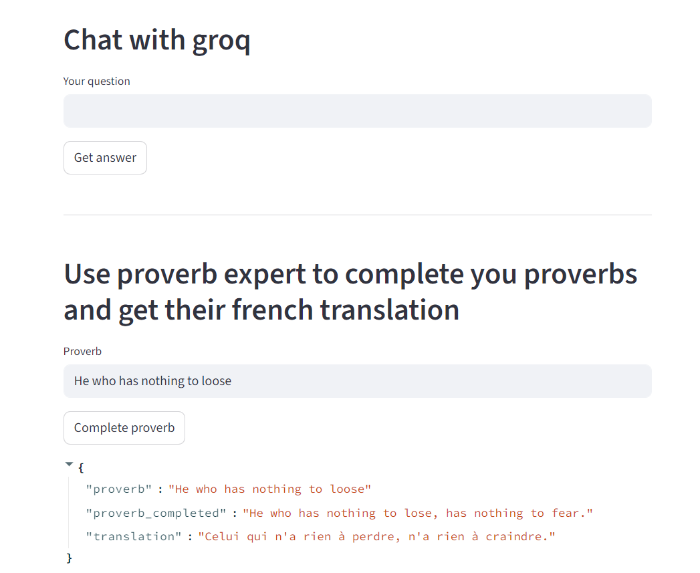

# Chatbot-powered-by-groq-llms-and-orchestration-with-langchain
This is a chatbot powered by llms provided by groq APIs and orchestrated using langchain graphs. 

- [Link to test app on hugginface_hub](https://huggingface.co/spaces/HAJJINIHamza/MIGROQ_Chat)

- Bellow a screen shot of the app:

 